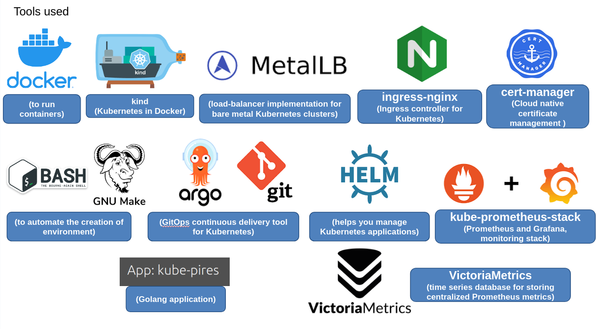
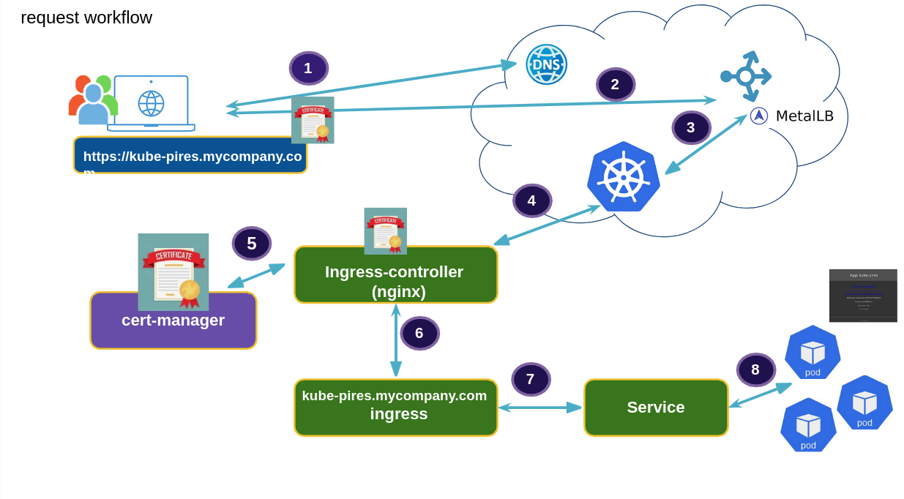

<!-- TOC -->

- [Contributing](#contributing)
- [VictoriaMetrics documentation](#victoriametrics-documentation)
- [Requirements](#requirements)
- [Create cluster and deploy applications](#create-cluster-and-deploy-applications)
  - [VictoriaMetrics Cluster Mode](#victoriametrics-cluster-mode)
  - [ingress-nginx](#ingress-nginx)
  - [certificate-manager](#certificate-manager)
  - [kube-stack-prometheus](#kube-stack-prometheus)
  - [kube-pires](#kube-pires)
- [Tools used](#tools-used)
- [Request workflow](#request-workflow)
- [Uninstall](#uninstall)
- [Maintainers](#maintainers)
- [License](#license)

<!-- TOC -->

# Contributing

See [CONTRIBUTING.md](CONTRIBUTING.md) file.

# VictoriaMetrics documentation

See [LEARNING_VICTORIAMETRICS.md](LEARNING_VICTORIAMETRICS.md) file.

# Requirements

Install all packages and binaries following this [tutorial](REQUIREMENTS.md).

# Create cluster and deploy applications

Create kind cluster and install helm apps using ``make`` command:

```bash
cd learning-victoriametrics
make up
```

Actions performed:

- Check requirements
- Create kind Kubernetes cluster
- Install helm apps: MetalLB, VictoriaMetrics (cluster mode), ingress-nginx, certificate-manager, kube-pires and kube-stack-prometheus
- Insert new entry in /etc/hosts (Linux/MacOS)

## VictoriaMetrics Cluster Mode

See the [helm-apps/victoriametrics-cluster-mode/README.md](victoriametrics-cluster-mode/README.md) file to configure VictoriaMetrics cluster mode.

## ingress-nginx

See the [helm-apps/ingress-nginx/README.md](helm-apps/ingress-nginx/README.md)

## certificate-manager

See the [helm-apps/certificate-manager/README.md](helm-apps/certificate-manager/README.md)

## kube-stack-prometheus

See the [helm-apps/kube-stack-prometheus/README.md](helm-apps/kube-stack-prometheus/README.md)

## kube-pires

See the [helm-apps/kube-pires/README.md](helm-apps/kube-pires/README.md)

# Tools used



# Request workflow



# Uninstall

Destroy Kind cluster and uninstall apps:

```bash
cd learning-victoriametrics
make down
```

# Maintainers

- Aécio dos Santos Pires ([linkedin.com/in/aeciopires](https://www.linkedin.com/in/aeciopires/?locale=en_US))

# License

GPL-3.0 Aécio dos Santos Pires
