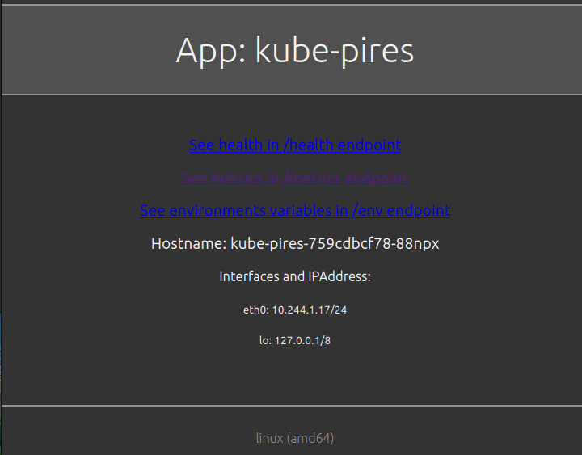

# install-kube-pires

<!-- TOC -->

- [install-kube-pires](#install-kube-pires)
- [Requirements](#requirements)
- [DNS](#dns)
- [References](#references)

<!-- TOC -->

# Requirements

- Install all packages and binaries following the instructions on the [REQUIREMENTS.md](../../REQUIREMENTS.md) file.
- Create the cluster following the instructions on the [README.md](../../README.md#create-the-cluster-and-deploy-applications) file.

# DNS

If needs add entry in ``/etc/hosts`` file:

> ATTENTION!!! You must be connected to the kind cluster

```bash
# Add entry in /etc/hosts for kube-pires
export IP=$(kubectl get ing kube-pires -n myapps -o json | jq -r .status.loadBalancer.ingress[].ip)
sudo grep -qxF "$IP  kube-pires.mycompany.com" /etc/hosts || sudo sh -c "echo '$IP  kube-pires.mycompany.com' >> /etc/hosts"
```

Open the browser and access the URL: https://kube-pires.mycompany.com/



``kube-pires`` is a web application developed using Golang.
It's show the follow informations of the pods:


- ``/``        => Show the hostname, interface name and IP addresses;
- ``/health``  => Show the status of the application;
- ``/metrics`` => Show the metrics in supported format by prometheus;
- ``/env``     => Show the environment variables;
- ``/css``     => Show the CSS template;

# References

- https://gitlab.com/aeciopires/kube-pires