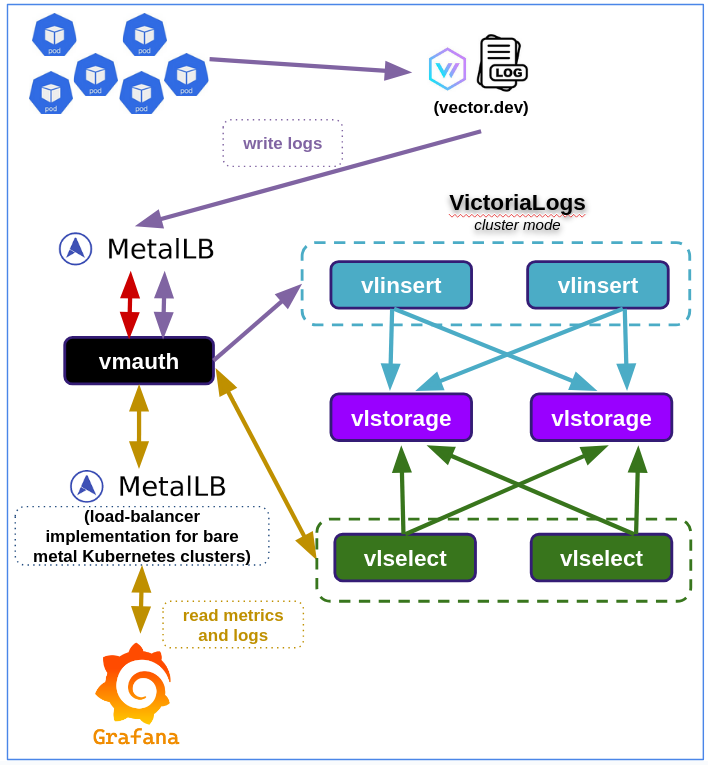

# install-victoria-logs-cluster-mode

<!-- TOC -->

- [install-victoria-logs-cluster-mode](#install-victoria-logs-cluster-mode)
- [Requirements](#requirements)
- [VictoriaLogs Cluster Mode](#victorialogs-cluster-mode)
- [Architecture](#architecture)
  - [vmui](#vmui)
  - [vmauth](#vmauth)
- [Troubleshooting](#troubleshooting)
- [Write API](#write-api)
  - [Read API](#read-api)
- [References](#references)

<!-- TOC -->

# Requirements

- Install all packages and binaries following the instructions on the [REQUIREMENTS.md](../../REQUIREMENTS.md) file.
- Create the cluster following the instructions on the [README.md](../../README.md#create-the-cluster-and-deploy-applications) file.

# VictoriaLogs Cluster Mode

> Reference: https://docs.victoriametrics.com/victorialogs/cluster/

Cluster mode in VictoriaLogs provides horizontal scaling to many nodes when [single-node VictoriaLogs](https://docs.victoriametrics.com/victorialogs/) reaches vertical scalability limits of a single host. If you have an ability to run a single-node VictoriaLogs on a host with more CPU/RAM/storage space/storage IO, then it is preferred to do this instead of switching to cluster mode, since a single-node VictoriaLogs instance has the following advantages over cluster mode:

- It is easier to configure, manage and troubleshoot, since it consists of a single self-contained component.
- It provides better performance and capacity on the same hardware, since it doesn’t need to transfer data over the network between cluster components.

# Architecture

VictoriaLogs in cluster mode consists of following components:

- **vlinsert**: accepts the ingested logs via [all the supported data ingestion protocols](https://docs.victoriametrics.com/victorialogs/data-ingestion/) and spreads them evenly among the ``vlstorage`` nodes listed via the ``-storageNode`` command-line flag.
- **vlselect**: accepts incoming queries via [all the supported HTTP querying endpoints](https://docs.victoriametrics.com/victorialogs/querying/), requests the needed data from ``vlstorage`` nodes listed via the ``-storageNode`` command-line flag, processes the queries and returns the corresponding responses.
- **vlstorage**: responsible for two tasks:
  - It accepts logs from ``vlinsert`` nodes and stores them at the directory specified via ``-storageDataPath`` command-line flag. See [these docs](https://docs.victoriametrics.com/victorialogs/#storage) for details about this flag.
  - It processes requests from ``vlselect`` nodes. It selects the requested logs and performs all data transformations and calculations, which can be executed locally, before sending the results to ``vlselect``.



Every component of the VictoriaLogs cluster can scale from a single node to arbitrary number of nodes and can run on the most suitable hardware for the given workload. ``vlinsert`` nodes can be used as ``vlselect`` nodes, so the minimum VictoriaLogs cluster must contain a ``vlstorage`` node plus a node, which plays both ``vlinsert`` and ``vlselect roles``. It isn’t recommended sharing ``vlinsert`` and ``vlselect`` responsibilities in a single node, since this increases chances that heavy queries can negatively affect data ingestion and vice versa.

``vlselect`` and ``vlinsert`` communicate with ``vlstorage`` via HTTP at the TCP port specified via ``-httpListenAddr`` command-line flag:

- ``vlinsert`` sends requests to ``/internal/insert`` HTTP endpoint at ``vlstorage``.
- ``vlselect`` sends requests to HTTP endpoints at ``vlstorage`` starting with ``/internal/select/``.

This allows using various http proxies for authorization, routing and encryption of requests between these components. It is recommended to use [vmauth.](https://docs.victoriametrics.com/victoriametrics/vmauth/)

## vmui

VictoriaMetrics cluster version provides UI for query troubleshooting and exploration. The UI allows exploring query results via graphs and tables.

If needs add entry in ``/etc/hosts`` file:

> ATTENTION!!! You must be connected to the kind cluster

```bash
kubectl wait --for=create ingress/victoria-logs-victoria-logs-cluster-vmauth --timeout=900s -n monitoring
export IP=$(kubectl get ing victoria-logs-victoria-logs-cluster-vmauth -n monitoring -o json | jq -r .status.loadBalancer.ingress[].ip)
sudo grep -qxF "$IP  victorialogs-cluster.mycompany.com" /etc/hosts || sudo sh -c "echo '$IP  victorialogs-cluster.mycompany.com' >> /etc/hosts"
```

- URL: https://victorialogs-cluster.mycompany.com/select/vmui/
- Login: user-logs-select
- password: changeme

## vmauth

**vmauth** is an HTTP proxy, which can authorize, route and load balance requests across VictoriaMetrics/VictoriaLogs components or any other HTTP backends.
Reference: https://docs.victoriametrics.com/victoriametrics/vmauth/

- URL: https://victorialogs-cluster.mycompany.com/
- Login: user-logs-select
- password: changeme

# Troubleshooting

Get the pods lists by running these commands:

```bash
kubectl get all -n monitoring | grep 'victoria\|vmauth'
```

# Write API

``Inside`` cluster:

The ``vlstorage`` accepts incoming requests at the port **9491** on the following DNS name from within your cluster: **victoria-logs-victoria-logs-cluster-vlstorage.monitoring.svc.cluster.local**

> **NOTE:** But outside cluster the service is accessed in external URL.

``vlinsert`` accepts logs at the port **9481** on the following DNS name from within your cluster: **victoria-logs-victoria-logs-cluster-vlinsert.monitoring.svc.cluster.local**

Internal URL for sent logs inside cluster:

```
http://victoria-logs-victoria-logs-cluster-vlinsert.monitoring.svc.cluster.local:9481/insert
```

## Read API

``vlselect`` accepts incoming queries at the port **9471** on the following DNS name from within your cluster: **victoria-logs-victoria-logs-cluster-vlselect.monitoring.svc.cluster.local**

> **NOTE:** But outside cluster the service is accessed in external URL.

You need to update specify select service URL in your Grafana:

> NOTE: you need to use Prometheus Data Source

Internal URL for datasource in Grafana installed inside cluster:

```
http://victoria-logs-victoria-logs-cluster-vlselect.monitoring.svc.cluster.local:9471/select/logsql/query
```

See [this doc](https://docs.victoriametrics.com/victorialogs/querying/) to learn about queries logs syntax.

# References

See [../../LEARNING_VICTORIAMETRICS.md](../../LEARNING_VICTORIAMETRICS.md) file.
