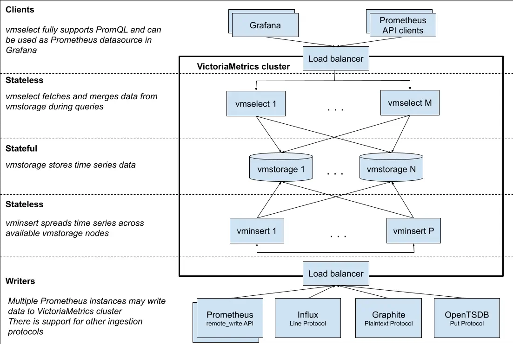

# install-victoria-metrics-cluster-mode

<!-- TOC -->

- [install-victoria-metrics-cluster-mode](#install-victoria-metrics-cluster-mode)
- [Requirements](#requirements)
- [Architecture](#architecture)
  - [vmui](#vmui)
  - [vmauth](#vmauth)
- [Troubleshooting](#troubleshooting)
- [Write API](#write-api)
  - [Read API](#read-api)
- [References](#references)

<!-- TOC -->

# Requirements

- Install all packages and binaries following the instructions on the [REQUIREMENTS.md](../../REQUIREMENTS.md) file.
- Create the cluster following the instructions on the [README.md](../../README.md#create-the-cluster-and-deploy-applications) file.

# Architecture

> Reference: https://docs.victoriametrics.com/victoriametrics/cluster-victoriametrics/

> Attention!!! It is recommended to use the [**single-node version**](https://github.com/VictoriaMetrics/VictoriaMetrics) instead of the cluster version for ingestion rates lower than a million data points per second. The single-node version scales perfectly with the number of CPU cores, RAM and available storage space. The single-node version is easier to configure and operate compared to the cluster version, so think twice before choosing the cluster version. See this question for more details.

**VictoriaMetrics** is a fast, cost-effective and scalable time series database. It can be used as a long-term remote storage for Prometheus.

**VictoriaMetrics cluster** consists of the following services:

- **vmstorage** - stores the raw data and returns the queried data on the given time range for the given label filters
- **vminsert** - accepts the ingested data and spreads it among vmstorage nodes according to consistent hashing over metric name and all its labels
- **vmselect** - performs incoming queries by fetching the needed data from all the configured vmstorage nodes



Each service may scale independently and may run on the most suitable hardware. vmstorage nodes don’t know about each other, don’t communicate with each other and don’t share any data. This is a shared nothing architecture. It increases cluster availability, and simplifies cluster maintenance as well as cluster scaling.


## vmui

VictoriaMetrics cluster version provides UI for query troubleshooting and exploration. The UI allows exploring query results via graphs and tables.

If needs add entry in ``/etc/hosts`` file:

> ATTENTION!!! You must be connected to the kind cluster

```bash
kubectl wait --for=create ingress/victoria-metrics-victoria-metrics-cluster-vmauth --timeout=900s -n monitoring
export IP=$(kubectl get ing victoria-metrics-victoria-metrics-cluster-vmauth -n monitoring -o json | jq -r .status.loadBalancer.ingress[].ip)
sudo grep -qxF "$IP  victoriametrics-cluster.mycompany.com" /etc/hosts || sudo sh -c "echo '$IP  victoriametrics-cluster.mycompany.com' >> /etc/hosts"
```

- URL: https://victoriametrics-cluster.mycompany.com/select/0/vmui/
- Login: user-select
- password: changeme

## vmauth

**vmauth** is an HTTP proxy, which can authorize, route and load balance requests across VictoriaMetrics components or any other HTTP backends.
Reference: https://docs.victoriametrics.com/victoriametrics/vmauth/

- URL: https://victoriametrics-cluster.mycompany.com/
- Login: user-select
- password: changeme

# Troubleshooting

Get the pods lists by running these commands:

```bash
kubectl get all -n monitoring | grep 'victoria\|vmauth'
```

# Write API

``Inside`` cluster:

The Victoria Metrics write api can be accessed via port **8480** on the following DNS name from within your cluster: **victoria-metrics-victoria-metrics-cluster-vminsert.monitoring.svc.cluster.local**

> **NOTE:** But outside cluster the service is accessed in external URL.

You need to update your prometheus configuration file and add next lines into it:

**prometheus.yml**

Internal URL for Prometheus sending data to Victoria Metrics:

```yaml
remote_write:
  - url: "http://victoria-metrics-victoria-metrics-cluster-vminsert.monitoring.svc.cluster.local:8480/insert/0/prometheus/"
```

## Read API

The Victoria Metrics read api can be accessed via port **8481** on the following DNS name from within your cluster: **victoria-metrics-victoria-metrics-cluster-vmselect.monitoring.svc.cluster.local**

> **NOTE:** But outside cluster the service is accessed in external URL.

You need to update specify select service URL in your Grafana:

> NOTE: you need to use Prometheus Data Source

Internal URL for datasource in Grafana installed inside cluster:

```
http://victoria-metrics-victoria-metrics-cluster-vmselect.monitoring.svc.cluster.local:8481/select/0/prometheus/
```

# References

See [../../LEARNING_VICTORIAMETRICS.md](../../LEARNING_VICTORIAMETRICS.md) file.
